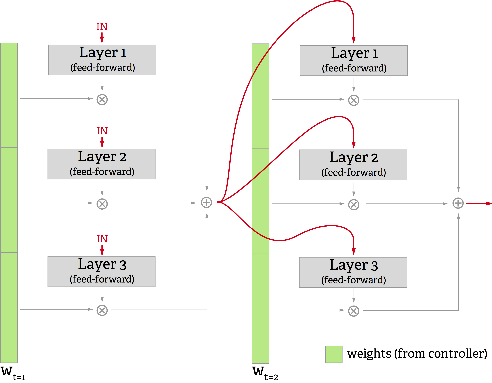

## Discussion

### Future work

#### Multi-step variant {#sec:multistep}

{#fig:multistep}

One obvious question to consider about this model is, "What happens if the correct output function at a timestep is not computable with a linear combination of single-layer networks?" After all, there are functions computable by a polynomial-width network of depth `k` that require exponential width to compute with a network of depth `k-1` [@hastad1986almost].

To address this question, the system could be run for a predefined number of steps between outputs. That is,

1. Feed the system the input for "real-world" time `t` and save the output
2. Repeat `k` times: 
	a. Feed the system its own most recent output
4. Take the `kth` output of the system as its answer for time `t`
5. Repeat from 1. for time `t+1`

This amounts to making the network deeper, in that more layers of computation and nonlinearity lie between the input and the output. This gives it the same computational power of a `k`-depth model.
