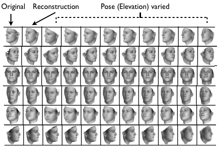
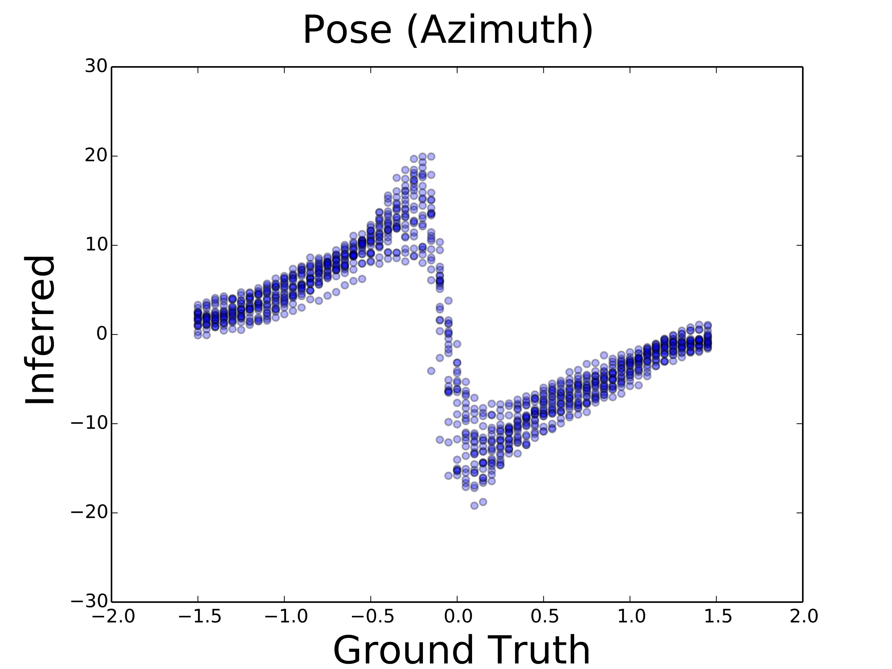
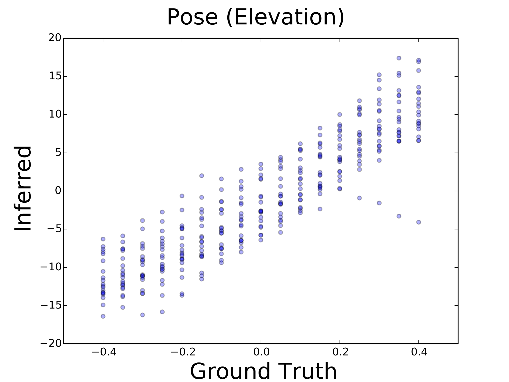
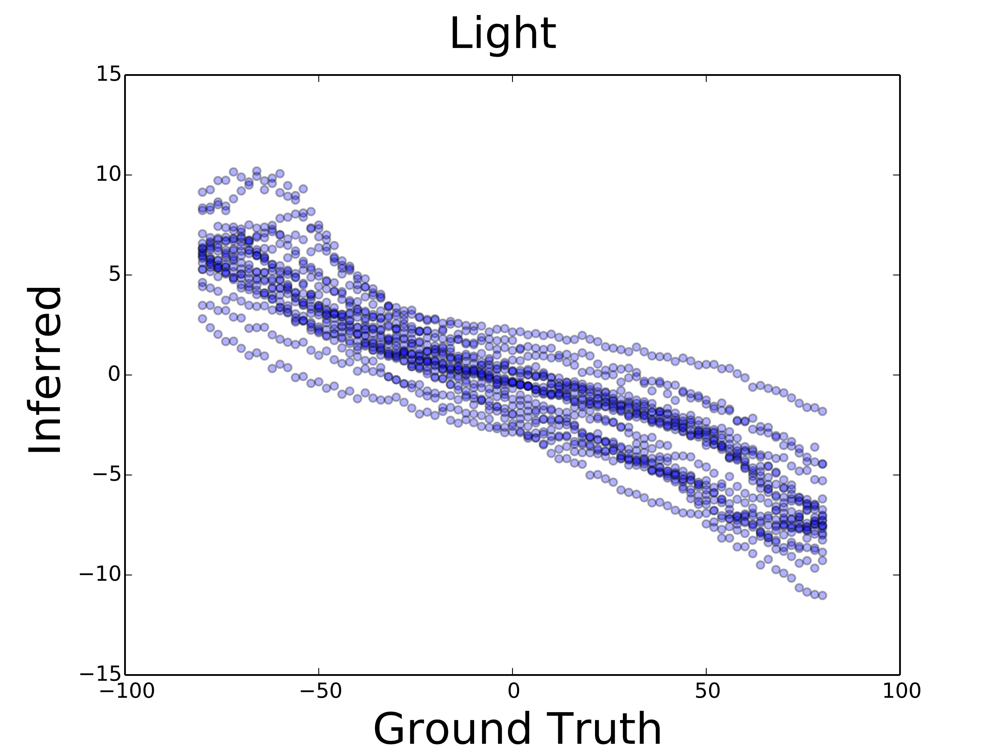
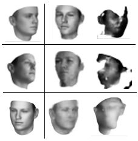
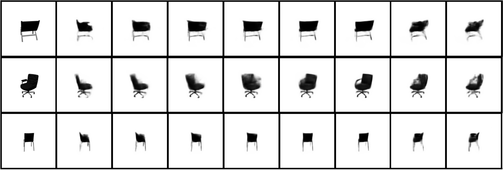
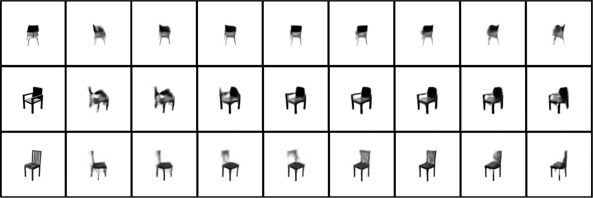

## Experiments

We trained our model on about 12,000 batches of faces generated from a 3D face model obtained from Paysan et al. [-@paysan2009face], where each batch consists of 20 faces with random variations on face identity variables (shape/texture), pose, or lighting. We used the _rmsprop_ [@rmsprop] learning algorithm during training and set the meta learning rate equal to $0.0005$, the momentum decay to $0.1$ and weight decay to $0.01$.

To ensure that these techniques work on other types of data, we also trained networks to perform reconstruction on images of widely varied 3D chairs from many perspectives derived from the Pascal Visual Object Classes dataset as extracted by Aubry et al. [@mottaghi2014role, @aubry2014seeing]. This task tests the ability of the DC-IGN to learn a rendering function for a dataset with high variation between the elements of the set; the chairs vary from office chairs to wicker to modern designs, and viewpoints span 360 degrees and two elevations. These networks were trained with the same methods and parameters as the ones above.

### 3D Face Dataset {#sec:gen}

The decoder network learns an approximate rendering engine as shown in [@Fig:pose, @Fig:pose_and_entangledcomparison]. Given a static test image, the encoder network produces the latents $Z$ depicting scene variables such as light, pose, shape etc. Similar to an off-the-shelf rendering engine, we can independently control these to generate new images with the decoder. For example, as shown in [@Fig:pose_and_entangledcomparison], given the original test image, we can vary the lighting of an image by keeping all the other latents constant and varying $z_{light}$. It is perhaps surprising that the fully-trained decoder network is able to function as a 3D rendering engine.

{height=40%}

{height=40%}

{height=40%}

**Generalization of decoder to render images in novel viewpoints and lighting conditions.** We generated several datasets by varying light, azimuth and elevation, and tested the invariance properties of DC-IGN's representation $Z$. We show quantitative performance on three network configurations as described in [@Sec:gen]. All DC-IGN encoder networks reasonably predicts transformations from static test images. Interestingly, as seen in the first plot, the encoder network seems to have learnt a _switch_ node to deal uniquely with the mirror-symmetric sides of the face.

We also quantitatively illustrate the network's ability to represent pose and light on a smooth linear manifold as shown in [@Fig:gen], which directly demonstrates our training algorithm's ability to disentangle complex transformations. In these plots, the inferred and ground-truth transformation values are plotted for a random subset of the test set. Interestingly, as shown in [@Fig:gen](a), the encoder network's representation of azimuth has a discontinuity at $0^\circ$ (facing straight forward).

{#fig:pose_and_entangledcomparison}

### Comparison with Entangled Representations
To explore how much of a difference the DC-IGN training procedure makes, we compare the novel-view reconstruction performance of networks with entangled representations (baseline) versus disentangled representations (DC-IGN). The baseline network is identical in every way to the DC-IGN, but was trained with SGVB without using our proposed training procedure. As in [@Fig:pose], we feed each network a single input image, then attempt to use the decoder to re-render this image at different azimuth angles. To do this, we first must figure out which latent of the entangled representation most closely corresponds to the azimuth. This we do rather simply. First, we encode all images in an azimuth-varied batch using the baseline's encoder. Then we calculate the variance of each of the latents over this batch. The latent with the largest variance is then the one most closely associated with the azimuth of the face, and we will call it $z_{azimuth}$. Once that is found, the latent $z_{azimuth}$ is varied for both the models to render a novel view of the face given a single image of that face. [@Fig:pose_and_entangledcomparison] shows that explicit disentanglement is critical for novel-view reconstruction.

### Chair Dataset

**Manipulating rotation:** Each row was generated by encoding the input image (leftmost) with the encoder, then changing the value of a single latent and putting this modified encoding through the decoder. The network has never seen these chairs before at any orientation. **(a)** Some positive examples. Note that the DC-IGN is making a conjecture about any components of the chair it cannot see; in particular, it guesses that the chair in the top row has arms, because it can't see that it doesn't. **(b)** Examples in which the network extrapolates to new viewpoints less accurately.}

We performed a similar set of experiments on the 3D chairs dataset described above. This dataset contains still images rendered from 3D CAD models of 1357 different chairs, each model skinned with the photographic texture of the real chair. Each of these models is rendered in 60 different poses; at each of two elevations, there are 30 images taken from 360 degrees around the model. We used approximately 1200 of these chairs in the training set and the remaining 150 in the test set; as such, the networks had never seen the chairs in the test set from any angle, so the tests explore the networks' ability to generalize to arbitrary chairs. We resized the images to $150 \times 150$ pixels and made them grayscale to match our face dataset.

We trained these networks with the azimuth (flat rotation) of the chair as a disentangled variable represented by a single node $z_1$; all other variation between images is undifferentiated and represented by $z_{[2,200]}$. The DC-IGN network succeeded in achieving a mean-squared error (MSE) of reconstruction of $2.7722 \times 10^{-4}$ on the test set. Each image has grayscale values in the range $[0,1]$ and is $150 \times 150$ pixels.

In [@Fig:chairpose] we have included examples of the network's ability to re-render previously-unseen chairs at different angles given a single image. For some chairs it is able to render fairly smooth transitions, showing the chair at many intermediate poses, while for others it seems to only capture a sort of "keyframes" representation, only having distinct outputs for a few angles. Interestingly, the task of rotating a chair seen only from one angle requires speculation about unseen components; the chair might have arms, or not; a curved seat or a flat one; etc.
